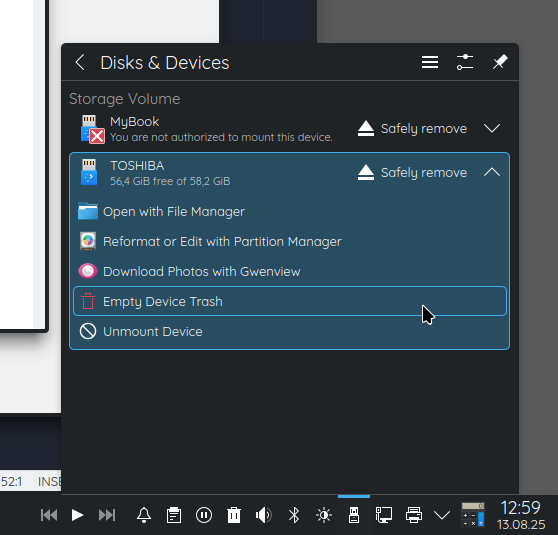

# Empty Device Trash

A KDE Solid Action to clear the trash of a removable device such as USB memory stick or flash drive before unmounting.


## Installation

This file goes into:

```
$HOME/.local/share/solid/actions/
```

## Usage

Just select "Empty Device Trash" from the list of actions available for a mounted removable device.



This will remove all files from hidden directories:

```
<media>/.Trash-$UID/files/
<media>/.Trash-$UID/info/
```

For many users this is:

```
<media>/.Trash-1000/files/
<media>/.Trash-1000/info/
```
